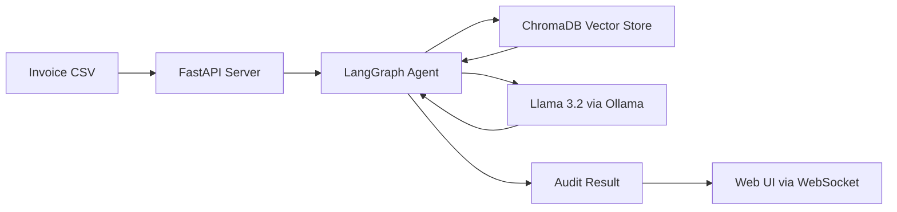

# 🛡️ Commercial Guardian AI

> **Automated Commercial Assurance & Invoice Auditing Agent**

An intelligent, privacy-first AI agent that runs 100% locally to prevent commercial leakage by auditing invoices against contract terms in real-time.

---

## 🌟 Key Features

- **🔒 Privacy First**: Runs entirely on your local infrastructure using Ollama and Llama 3.2 (3B) - no financial data ever leaves your system
- **🧠 RAG Architecture**: Ingests PDF/Markdown contracts into ChromaDB vector database to ground audit decisions in actual contract terms
- **⚡ Real-Time Auditing**: Validates individual invoices for rate discrepancies, missing approvals, and missed volume discounts
- **🔍 Forensic Analysis**: Aggregates historical data to identify "Price Creep" and systematic billing errors
- **🎯 Agentic Workflow**: Uses LangGraph to orchestrate multi-step analysis (Retrieve → Audit → Draft)
- **🌐 Web Interface**: FastAPI backend with WebSocket-powered real-time visualization

---

## 🏗️ Architecture



**Technology Stack:**
- **LLM**: Llama 3.2 (3B) via Ollama
- **Framework**: LangChain + LangGraph
- **Vector DB**: ChromaDB (local)
- **API**: FastAPI with WebSocket support
- **Orchestration**: Docker Compose

---

## 📁 Project Structure

```
.
├── data/
│   ├── Contracts/          # Place .md or parsed .pdf contracts here
│   └── Transactions/       # Invoice .csv files
├── scripts/
│   ├── check_import_api.py          # Dependency checker
│   └── download-static-assets.ps1   # UI asset downloader
├── static/
│   └── index.html          # Web UI for live auditing visualization
├── API.py                  # FastAPI server with WebSocket endpoint
├── Guardian.py             # LangGraph workflow (CLI version)
├── guardian_demo.py        # Real-time auditing demo
├── guardian_bulk.py        # Forensic/historical analysis
├── Dockerfile              # Python app container
├── Dockerfile.ollama       # Ollama service container
├── compose.yaml            # Multi-container orchestration
├── Requirements.txt        # Python dependencies
└── Demo.ps1               # Windows quick-start script
```

---

## 🚀 Quick Start

### Prerequisites
- [Docker Desktop](https://www.docker.com/products/docker-desktop/) installed and running
- At least 4GB RAM available for containers

### Option 1: Run the Demo (Recommended)

**Windows:**
```powershell
.\Demo.ps1
```

**Mac/Linux:**
```bash
chmod +x demo.sh
./demo.sh
```

**Choose Your Mode:**
1. **Real-Time Mode**: Processes `Transactions.csv`. Watch it detect a $12,000 vs $10,000 rate error
2. **Forensic Mode**: Generates 6 months of synthetic data to demonstrate price creep detection

### Option 2: Manual Docker Setup

```bash
# Start all services
docker-compose up --build

# Access the web interface
open http://localhost:8000

# View logs
docker-compose logs -f guardian_app
```

### Option 3: Run via Python (Advanced)

```bash
# Install dependencies
pip install -r Requirements.txt

# Ensure Ollama is running locally
ollama pull llama3.2

# Run the CLI agent
python Guardian.py run-now
```

---

## 📊 How It Works

### 1. Contract Ingestion
The system loads contract `.md` files from `data/Contracts/` and embeds them into ChromaDB using local embeddings.

### 2. Agentic Workflow (LangGraph)
Each invoice triggers a multi-step analysis:

```python
Retrieve → Audit → Draft → End
```

- **Retrieve**: Fetches relevant contract clauses via vector similarity search
- **Audit**: LLM compares invoice against contract terms
- **Draft**: Generates email communication (approval or dispute)

### 3. Real-Time Visualization
The web UI connects via WebSocket to stream live audit results showing:
- Invoice ingestion
- Contract retrieval
- AI analysis
- Approval/dispute routing

---

## 🔧 Customization

### Add New Contracts
1. Place any `.md` file in `data/Contracts/`
2. Restart the demo - the agent will automatically ingest new terms

**Example Contract Format:**
```markdown
# Vendor Agreement - Tech Solutions Ltd

## Rate Card
- Senior Engineering: $1,200/day
- Junior Engineering: $600/day

## Payment Terms
- Net 30 days
- 10% volume discount for orders >10 days

## Pre-Approvals Required
- Travel expenses over $500
- Weekend work
```

### Use Your Own Invoice Data
Replace `data/Transactions/Transactions.csv` with exports from SAP/Oracle/NetSuite.

**Required CSV Columns:**
- `invoice_id` or `Invoice ID`
- `vendor`
- `total_amount` or `amount`
- `line_items` or `item`

---

## 🧪 Example Use Cases

### Detected Anomalies
✅ **Rate Validation**: Caught $1,200 charge vs $1,000 contract rate  
✅ **Volume Discounts**: Flagged missing 10% discount on 15-day order  
✅ **Approval Compliance**: Identified $850 travel expense without pre-approval  
✅ **Price Creep**: Forensic mode detected gradual rate increase from $10.00 → $10.50

---

## 🐳 Docker Services

The `compose.yaml` defines two services:

| Service | Purpose | Port |
|---------|---------|------|
| `ollama_service` | Llama 3.2 inference engine | 11434 |
| `guardian_app` | FastAPI + LangGraph agent | 8000 |

---

## 🛠️ Development

### Check Dependencies
```bash
python scripts/check_import_api.py
```

### Download Web Assets
```powershell
.\scripts\download-static-assets.ps1
```

### Environment Variables
Set in `compose.yaml` or `.env`:
```bash
OLLAMA_BASE_URL=http://ollama_service:11434
MODEL_NAME=llama3.2
```

---

## 📝 License

This project is provided as-is for demonstration purposes.

---

## 🤝 Contributing

This is a learning/demo project. Feel free to fork and experiment!

---

## 🙏 Acknowledgments

Built with:
- [LangChain](https://langchain.com/) - LLM application framework
- [LangGraph](https://langchain-ai.github.io/langgraph/) - Agentic workflow orchestration
- [Ollama](https://ollama.ai/) - Local LLM runtime
- [ChromaDB](https://www.trychroma.com/) - Vector database
- [FastAPI](https://fastapi.tiangolo.com/) - Modern Python web framework

---

**Made with ❤️ for commercial assurance teams everywhere**
